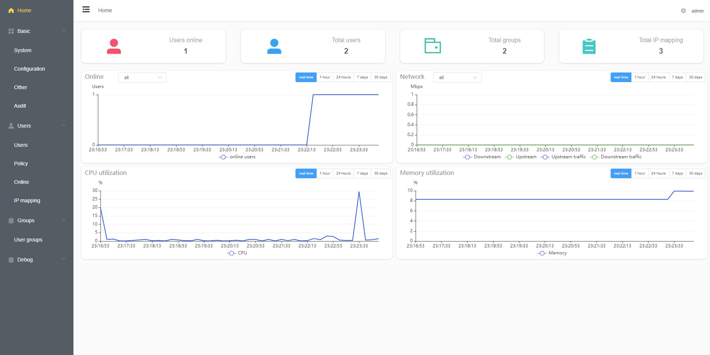
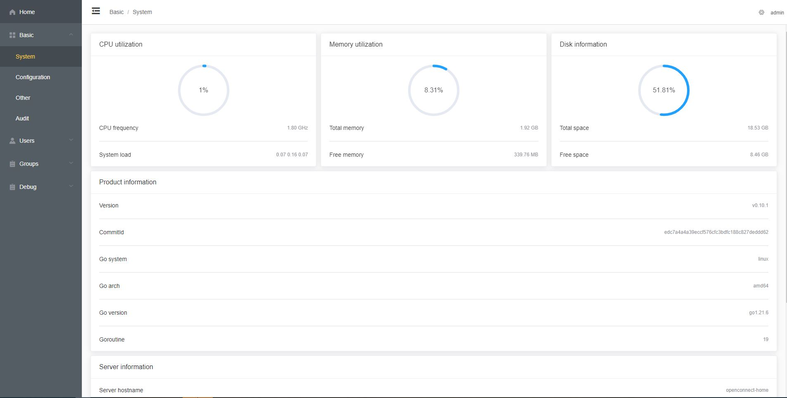
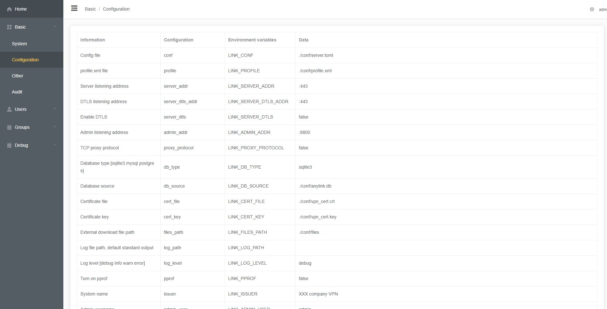
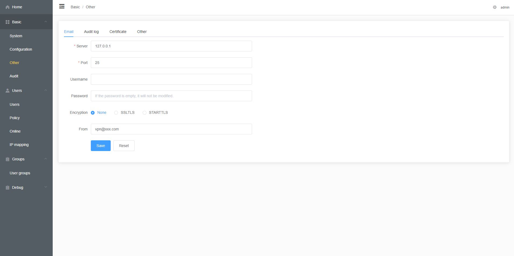
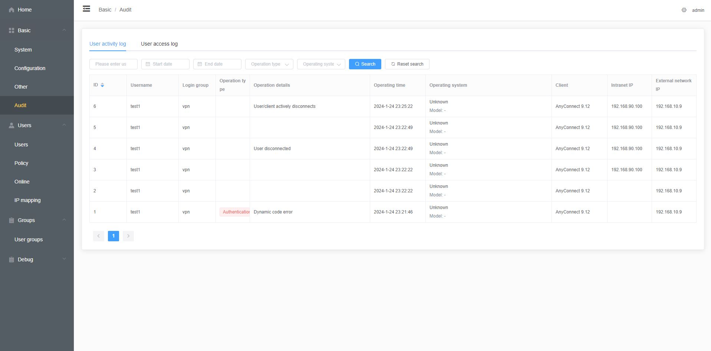
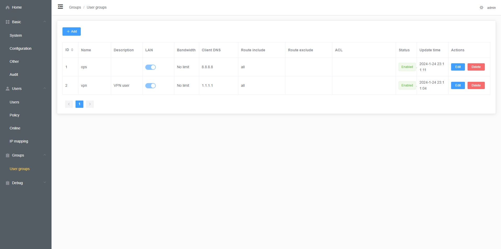

# AnyLink (English version)

[](https://github.com/cherts/anylink/actions)
[](https://pkg.go.dev/github.com/cherts/anylink)
[](https://goreportcard.com/report/github.com/cherts/anylink)
[](https://codecov.io/gh/cherts/anylink)


[](https://hub.docker.com/r/cherts/anylink)


AnyLink is an enterprise-level remote office sslvpn software that can support multiple people using it online at the same time.

## Repo

> Github: https://github.com/cherts/anylink

## Introduction

AnyLink is based on [ietf-openconnect](https://tools.ietf.org/html/draft-mavrogiannopoulos-openconnect-02)
Protocol development, and draws on the development ideas of [ocserv](http://ocserv.gitlab.io/www/index.html) to make it compatible with the AnyConnect client at the same time.

AnyLink uses TLS/DTLS for data encryption, so an RSA or ECC certificate is required. You can apply for a free SSL certificate through Let's Encrypt and TrustAsia.

The AnyLink server is only tested on CentOS 7, CentOS 8, Ubuntu 18.04, Ubuntu 20.04 and Ubuntu 22.04. If it needs to be installed on other systems, the server needs to support the tun/tap function and ip setting command, iptables command.

## Screenshot



## Installation

> People without programming foundation are recommended to download the release package directly and download anylink-deploy.tar.gz from the address below.
>
> https://github.com/cherts/anylink/releases

### Usage issues

> For the test environment, you can use vpn.xxx.com to bind the host for testing
>
> For online environments, you must apply for a secure https certificate, and private certificate connections are not supported.
>
> Server installation yum install iproute or apt-get install iproute2
>
> Please use the version of the group shared file for the client. Other versions have not been tested and are not guaranteed to work properly.
>
> Other questions [Go to view](doc/question.md)
>
> For first time use, please visit https://domain name:443 in the browser. After the browser prompts that it is safe, enter [domain name: 443] on the client.

### Compile and install by yourself

> Docker needs to be installed in advance

```shell
git clone https://github.com/cherts/anylink.git

# docker compilation reference software version (no installation required)
# go 1.22
# node v16.20.2
# yarn 1.22.19

cd anylink
# Compile front-end
bash build_web.sh
# Compile anylink-deploy release files
bash build.sh

# Make sure to run with root privileges
cd anylink-deploy
sudo ./anylink

# Default management background access address
# Note that the host is the internal network IP of anylink and cannot be the same as the IP requested by the client.
# https://host:8800
# Default account password
# admin 123456
```

## Feature

- [x] IP allocation (implementing persistence of IP and MAC mapping information)
- [x] TLS-TCP tunnel
- [x] DTLS-UDP channel
- [x] Compatible with AnyConnect
- [x] Compatible with OpenConnect
- [x] Nat access mode based on tun device
- [x] Bridged access mode based on tun device
- [x] Bridged access mode based on macvtap device
- [x] Support [proxy protocol v1&v2](http://www.haproxy.org/download/2.2/doc/proxy-protocol.txt) protocol
- [x] User group support
- [x] User group policy support
- [x] Multi-user support
- [x] User policy support
- [x] TOTP token support
- [x] TOTP token switch
- [x] Traffic rate limit
- [x] Backend management interface
- [x] Access rights management
- [x] User activity audit function
- [x] IP access audit function
- [x] Domain name dynamic split tunnel (domain name routing function)
- [x] radius authentication support
- [x] LDAP authentication support
- [x] Automatically disconnect when idle link times out
- [x] Traffic compression function
- [x] Automatic release of egress IP
- [x] Support configuration differentiation of multiple services
- [ ] Bridge access mode based on ipvtap device

## Config

> There are detailed comments in the sample configuration file. Just fill in the configuration according to the comments.

```shell
# View help information
./anylink -h

# Generate admin password
./anylink tool -p 123456

# Generate JWT key
./anylink tool -s

# View all configuration items
./anylink tool -d
```

> Database configuration example
>
> Database table structure is automatically generated, no need to manually import (please grant DDL permission)

| db_type  | db_source                                              |
|----------|--------------------------------------------------------|
| sqlite3  | ./conf/anylink.db                                      |
| mysql    | user:password@tcp(127.0.0.1:3306)/anylink?charset=utf8 |
| postgres | user:password@localhost/anylink?sslmode=verify-full    |

> Sample configuration file
>
> [conf/server-sample.toml](server/conf/server-sample.toml)

## Upgrade

> Please back up the configuration file `conf` directory and database before upgrading, and stop the service
>
> Replace the old version with the new version of the `anylink` binary
>
> After restarting the service, the upgrade can be completed


## Setting

### Dependency settings

> Server-side dependency installation:
>
> centos: yum install iptables iproute
>
> ubuntu: apt-get install iptables iproute2

### link_mode setting

> One of the following parameters must be set

To select the network mode, you need to configure the `link_mode` parameter, such as `link_mode="tun"`, `link_mode="macvtap"`, `link_mode="tap"(not recommended)` and other parameters.
Different parameters require corresponding settings on the server.

It is recommended to choose tun mode first, followed by macvtap mode, because the client transmits IP layer data and does not need to perform data conversion. tap mode is done in user mode at the link layer to
Data at the IP layer is converted to each other, and performance will be degraded. If you need to enable tap in the virtual machine
mode, please confirm that the virtual machine's network card is enabled in promiscuous mode.

### tun settings

1. Enable server forwarding

```shell
# The new version supports automatic setting of IP forwarding
# file: /etc/sysctl.conf
net.ipv4.ip_forward = 1

# Execute command
sysctl -w net.ipv4.ip_forward=1

# Check whether the settings take effect
cat /proc/sys/net/ipv4/ip_forward
```

2.1 Set nat forwarding rules (choose one of two)

```shell
systemctl stop firewalld.service
systemctl disable firewalld.service

# The new version supports automatic setting of NAT forwarding. If you have other needs, you can refer to the following command configuration.

# Please replace eth0 according to the server's internal network card
# iptables -t nat -A POSTROUTING -s 192.168.90.0/24 -o eth0 -j MASQUERADE
# If the first command does not take effect, you can continue to execute the following command
# iptables -A FORWARD -i eth0 -s 192.168.90.0/24 -j ACCEPT
# Check whether the settings take effect
# iptables -nL -t nat
```

2.2 Use global route forwarding (choose one of two)

```shell
# Assume the intranet IP of the server where anylink is located: 10.1.2.10

# First turn off the nat forwarding function
iptables_nat = false

# For traditional network architecture, add the following static routing rules to the H3C switch
ip route-static 192.168.90.0 255.255.255.0 10.1.2.10
# For switch commands of other brands, please refer to the following address
https://cloud.tencent.com/document/product/216/62007

# In a public cloud environment, you need to set up the routing table under vpc and add the following routing policy
Destination: 192.168.90.0/24
Next hop type: Cloud server
Next hop: 10.1.2.10

```

3. Just connect using the AnyConnect client

#### Bridge settings

1. Set up the configuration file

> macvtap setting is relatively simple, you only need to configure the corresponding parameters.
>
> Network requirements: The network needs to support ARP transmission, and ordinary intranet IP can be announced through ARP.
>
> Network restrictions: cannot be used in cloud environment, cannot be used in network card mac plus white environment, cannot be used in 802.1x certified network
>
> The following parameters can be viewed by executing `ip a`

1.1 arp_proxy

```

# file: /etc/sysctl.conf
net.ipv4.conf.all.proxy_arp = 1

#Execute the following command
sysctl -w net.ipv4.conf.all.proxy_arp=1

Configuration file modification:

# First turn off the nat forwarding function
iptables_nat = false


link_mode = "tun"
#Internal network main network card name
ipv4_master = "eth0"
#The following network segments need to be set the same as the ipv4_master network card
ipv4_cidr = "10.1.2.0/24"
ipv4_gateway = "10.1.2.99"
ipv4_start = "10.1.2.100"
ipv4_end = "10.1.2.200"

```

1.2 macvtap

```

# Command line execution master network card needs to turn on promiscuous mode
ip link set dev eth0 promisc on

#=====================#

# Configuration file modification
# First turn off the nat forwarding function
iptables_nat = false

link_mode = "macvtap"
#Internal network main network card name
ipv4_master = "eth0"
#The following network segments need to be set the same as the ipv4_master network card
ipv4_cidr = "10.1.2.0/24"
ipv4_gateway = "10.1.2.1"
ipv4_start = "10.1.2.100"
ipv4_end = "10.1.2.200"
```

## Deploy

> The deployment configuration file is placed in the `deploy` directory. Please modify the configuration file according to the actual situation.

## Systemd

1. Add anylink program

    - Copy `anylink-deploy/anylink` binary to `/usr/sbin/anylink`
    - Add execution permissions `chmod +x /usr/sbin/anylink`

2. Added config file

    - Create config directory `/etc/anylink`
    - Copy file `anylink-deploy/conf/server-sample.toml` to `/etc/anylink/server.toml`
    - Copy file `anylink-deploy/conf/profile.xml`, `anylink-deploy/conf/vpn_cert.crt`, `anylink-deploy/conf/vpn_cert.key` to `/etc/anylink`

3. Added working file

    - Create working directory `/var/lib/anylink` and `/var/lib/anylink/files`
    - Copy file `anylink-deploy/conf/files/index.html`, `anylink-deploy/conf/files/info.txt` to `/var/lib/anylink/files`

4. Copy systemd unit file `anylink-deploy/systemd/anylink.service` to:

    - for CentOS: `/usr/lib/systemd/system/`
    - for Ubuntu: `/lib/systemd/system/`
    - and exec: `systemctl daemon-reload`

5. Operation command:

    - Start: `systemctl start anylink`
    - Stop: `systemctl stop anylink`
    - Start automatically at boot: `systemctl enable anylink`

### Docker Compose

1. Enter the `deploy` directory
2. Execute `docker-compose up`

### k8s

1. Enter the `deploy` directory
2. Execute `kubectl apply -f deployment.yaml`

## Docker

1. Get image

   ```bash
   # Specific tags can be obtained from docker hub
   # https://hub.docker.com/r/cherts/anylink/tags
   docker pull cherts/anylink:latest
   ```

2. View command information

   ```bash
   docker run -it --rm cherts/anylink -h
   ```

3. Generate password

   ```bash
   docker run -it --rm cherts/anylink tool -p 123456
   #Passwd:$2a$10$lCWTCcGmQdE/4Kb1wabbLelu4vY/cUwBwN64xIzvXcihFgRzUvH2a
   ```

4. Generate JWT secret

   ```bash
   docker run -it --rm cherts/anylink tool -s
   #Secret:9qXoIhY01jqhWIeIluGliOS4O_rhcXGGGu422uRZ1JjZxIZmh17WwzW36woEbA
   ```

5. View all configuration items
   ```bash
   docker run -it --rm cherts/anylink tool -d
   ```

6. Start container

   ```bash
   # Start by default
   docker run -itd --name anylink --privileged \
       -p 443:443 -p 8800:8800 -p 443:443/udp \
       --restart=always \
       cherts/anylink

   # Custom configuration directory
   # A configuration file will be automatically created on first startup
   # After the configuration file is initialized, the container will be forced to exit. Please restart the container.
   docker run -itd --name anylink --privileged \
       -p 443:443 -p 8800:8800 -p 443:443/udp \
       -v /home/myconf:/app/conf \
       --restart=always \
       cherts/anylink
   
   docker restart anylink
   ```

7. Start container with custom parameters
   ```bash
   # Parameters can refer to ./anylink tool -d
   # You can use command line parameters or environment variables to configure
   docker run -itd --name anylink --privileged \
       -e LINK_LOG_LEVEL=info \
       -p 443:443 -p 8800:8800 -p 443:443/udp \
       -v /home/myconf:/app/conf \
       --restart=always \
       cherts/anylink \
       --ip_lease=1209600 # IP address lease length
   ```

8. Build the image (optional)

   ```bash
   # Get the warehouse source code
   git clone https://github.com/cherts/anylink.git
   # Build image
   bash build_docker.sh
   or
   docker build -t anylink -f docker/Dockerfile .
   ```

## Common problem

Please go to [question address](doc/question.md) for detailed information

## Discussion

Telegram: @cherts

## Support Client

- [AnyConnect Secure Client](https://www.cisco.com/) (Can be downloaded through group files: Windows/macOS/Linux/Android/iOS)
- [OpenConnect](https://gitlab.com/openconnect/openconnect) (Windows/macOS/Linux)
- [Mikata AnyLink Secure Client](https://github.com/tlslink/anylink-client) (Windows/macOS/Linux)
- [Third-party client download address](https://cisco.yangpin.link) (Windows/macOS/Linux/Android/iOS)

## Contribution

Welcome to submit PRs and Issues, and thank you for contributing to AnyLink.

Note that when creating a new PR, you need to submit it to the dev branch, and other branches will not be merged yet.

## Other Screenshot

<details>
<summary>Expand to view</summary>









</details>

## License

This project adopts the AGPL-3.0 open source license, and the complete authorization instructions have been placed in the LICENSE file.

## Original project anylink (in Chinese)

<a href="https://github.com/bjdgyc/anylink">anylink</a>
